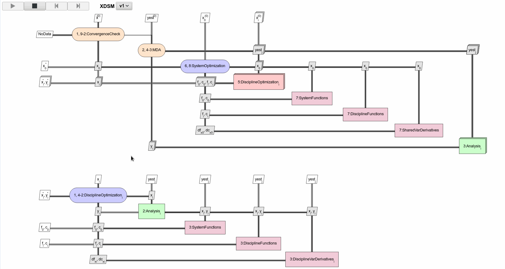
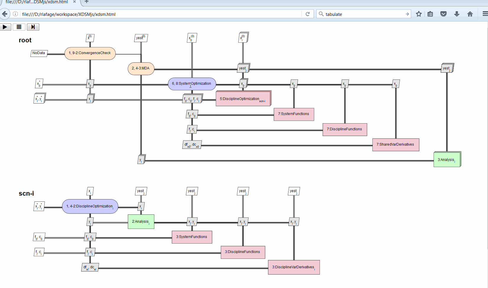

# XDSMjs
XDSM diagram generator written in javascript.

[](https://travis-ci.org/OneraHub/XDSMjs)
[](https://www.codacy.com/manual/relf/XDSMjs?utm_source=github.com&amp;utm_medium=referral&amp;utm_content=OneraHub/XDSMjs&amp;utm_campaign=Badge_Grade)

## XDSM
The XDSM (eXtended Design Structure Matrix) is a notation used to visualize MDO processes.
It was developed by A. B. Lambe and J. R. R. A. Martins, see [MDOLab website dedicated page.](http://mdolab.engin.umich.edu/content/xdsm-overview)

XDSM permissions:
> If you use the XDSM format for research, we ask that you cite the following journal publication in your work:
> A. B. Lambe and J. R. R. A. Martins, “Extensions to the Design Structure Matrix for the Description of Multidisciplinary Design, Analysis, and Optimization Processes”, Structural and Multidisciplinary Optimization, vol. 46, no. 2, p. 273-284, 2012.

## Description
XDSMjs is a javascript generator allowing to display a XDSM diagram within a web page.
It is based on [D3](https://d3js.org/).
It uses the <code>xdsm.json</code> file as input which contains required MDO information to generate the XDSM diagram. See the dedicated Wiki page for a description of the [XDSMjs JSON format](https://github.com/OneraHub/XDSMjs/wiki/XDSMjs-JSON-format).

As of 0.6.0, the MDO data can be specified through data attribute. 

As of 0.7.0, XDSMjs supports also [XDSM v2](https://github.com/mdolab/pyXDSM/releases/tag/v2.0). See [Upgrade to 0.7.0 notes](https://github.com/OneraHub/XDSMjs/wiki/Upgrade-to-XDSMjs-0.7.0).



## Citation
If you happen to find XDSMjs useful for research and include diagrams generated with it, it will be appreciated if you cite [the paper which describes the WhatsOpt project that led to XDSMjs development](https://github.com/OneraHub/WhatsOpt#citation)

## Usage

``` bash
> cd <install-dir>/XDSMjs
```
``` bash
> python -m http.server 8020
```
Open `http://localhost:8020/xdsm.html` in the browser.

To see other diagrams, copy a json example from `examples` directory as xdsm.json and reload the page.

As of 0.6.0 version, to use XDSMjs in your web page, you can :
* include the following declarations in your header :

```html
  <link rel="stylesheet" href="xdsmjs.css">
  <script type="text/javascript" src="dist/xdsmjs.js"></script>
```

* add the place-holder div element that will contain the XDSM diagram :

```html
  <div class="xdsm"></div>
```

You can either use the attribute <code>data-mdo</code> to specify MDO data in the XDSMjs JSON format in an HTML escaped string 

```html
  <div class="xdsm" data-mdo="{&quot;root&quot;: {&quot;nodes&quot;: [...], &quot;edges&quot;: [...], ... }}"></div>
```

or use the attribute <code>data-mdo-file</code> to specify another MDO filename

```html
  <div class="xdsm" data-mdo-file="examples/mdf.json"></div>
```
If no data attribute is specified, the default file <code>xdsm.json</code> is expected.

As of 0.7.0, you can use XDSM v2 notation by using <code>xdsm2</code> class instead of <code>xdsm</code>.

```html
  <div class="xdsm2"></div>
```

As of 0.8.0, you can specify configuration and MDO data directly from the <code><script></code> element in the html file.
<pre>
    <script type="text/javascript">
        document.addEventListener('DOMContentLoaded', () => {
            let mdo = {nodes: ..., edges: ...}
            let config = { labelizer: { showNbLinkOnly: true } };
            XDSMjs(config).createXdsm(mdo);
        });
    </script>
</pre>

## Example
Below an example describing BLISS formulation inspired from XDSM description given in [Martins and Lambe MDO architecture survey](http://arc.aiaa.org/doi/pdf/10.2514/1.J051895). While the formulation could have been described in one diagram as in the survey, the example below use XDSMjs multi-level diagram capability to separate system and discipline optimization levels.
The corresponding [xdsm.json](./examples/bliss.json) file is available in the example directory.



## Troubleshooting
* If you don't see the diagram, may be you need to serve the files with your favourite HTTP server ('same origin' policy of your browser). An example with Python HTTP simple server:


## Licence
 Copyright 2020 Rémi Lafage

   Licensed under the Apache License, Version 2.0 (the "License");
   you may not use this file except in compliance with the License.
   You may obtain a copy of the License at

       http://www.apache.org/licenses/LICENSE-2.0

   Unless required by applicable law or agreed to in writing, software
   distributed under the License is distributed on an "AS IS" BASIS,
   WITHOUT WARRANTIES OR CONDITIONS OF ANY KIND, either express or implied.
   See the License for the specific language governing permissions and
   limitations under the License.
